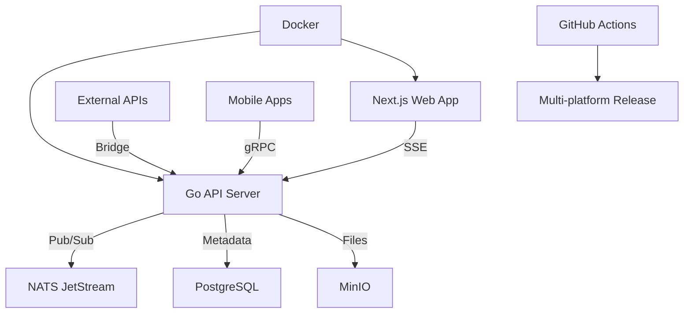

# FluxChat

[](https://github.com/yukihamada/fluxchat)
[](https://github.com/yukihamada/fluxchat/actions)
[](https://goreportcard.com/report/github.com/yukihamada/fluxchat)
[](https://opensource.org/licenses/MIT)
[](https://nextjs.org/)
[](https://golang.org/)

🚀 **超高速・統合メッセージングプラットフォーム** - Real-time unified messaging with NATS JetStream, Go, and Next.js

## ✨ Features

### 🔄 Real-time Messaging
- **NATS JetStream** による高信頼メッセージキューイング  
- **Server-Sent Events (SSE)** でリアルタイム配信
- メッセージの冪等性保証と重複排除
- 自動再接続とコネクション状態管理

### 📱 Unified Inbox
- 複数ソース統合表示（native, tg, dma, external）
- レスポンシブデザイン & アクセシビリティ対応
- キーボードショートカット完全対応
- 仮想化リストで大量メッセージ処理

### 🛡️ Security & Quality
- E2E暗号化対応（MLS方式、段階導入予定）
- 多層セキュリティスキャン（Trivy, Semgrep, CodeQL）
- 自動依存関係更新（Dependabot）
- コード品質ゲート（Lint, 静的解析）

### ⚡ Performance
- Go製高性能APIサーバー
- Next.js App Router + React Query
- Docker化 & マルチアーキテクチャ対応
- 水平スケール対応設計

## 🚀 Quick Start

### 30秒でデモ体験
```bash
git clone https://github.com/yukihamada/fluxchat.git
cd fluxchat
./demo.sh
```
→ **http://localhost:3000/inbox** でリアルタイムメッセージングを体験！

### Prerequisites
- **Node.js 18+** - Frontend development
- **Go 1.23+** - Backend development  
- **Docker** (Optional) - Infrastructure services

### Development Setup

#### Option A: One-command Demo
```bash
./demo.sh
```
✅ Starts all services automatically  
✅ Opens in browser with real-time messaging

#### Option B: Manual Setup
```bash
# 1. Install dependencies
cd apps/api && go mod tidy
cd ../web && npm install

# 2. Start infrastructure (optional)
docker compose up -d

# 3. Start services
make dev  # or manually:
# Terminal 1: cd apps/api && go run .
# Terminal 2: cd apps/web && npm run dev
```

#### Option C: Claude Code Integration
```bash
# Start Claude Code
claude

# Use built-in commands
/bootstrap   # Setup & expand project
/dev        # Start development stack  
/test       # Run all tests
```

## 📊 What Can You Do Right Now?

### 💬 Real-time Chat Experience
1. Open **http://localhost:3000/inbox** in multiple browser tabs
2. Send messages from one tab
3. Watch them appear instantly in other tabs
4. Test connection status & auto-reconnection

### 🔌 API Testing
```bash
# Health check
curl http://localhost:8080/health

# Send message
curl -X POST http://localhost:8080/api/messages/send \
  -H "Content-Type: application/json" \
  -d '{"content":"Hello FluxChat!","recipient":"demo-user"}'

# Real-time stream
curl http://localhost:8080/api/stream?user_id=demo-user
```

### 🧪 Testing & Quality
```bash
# Run all tests
make test

# E2E testing (3 browsers)
make test-e2e

# E2E with UI (debug mode)  
make test-e2e-ui
```

## 🏗️ Architecture



### Technology Stack
| Layer | Technology |
|-------|-----------|
| **Frontend** | Next.js 14, React 18, React Query, Tailwind CSS |
| **Backend** | Go 1.23, chi router, NATS JetStream |
| **Database** | PostgreSQL, NATS KV |
| **Storage** | MinIO (S3-compatible) |
| **Testing** | Jest, Playwright (Chromium/Firefox/WebKit) |
| **CI/CD** | GitHub Actions, Docker, Multi-arch builds |
| **Security** | Trivy, Semgrep, CodeQL, Dependabot |

## 📁 Project Structure

```
fluxchat/
├── apps/
│   ├── api/                 # Go backend
│   │   ├── internal/
│   │   │   ├── handlers/    # HTTP handlers
│   │   │   └── messaging/   # NATS JetStream
│   │   ├── Dockerfile       # Production container
│   │   └── main.go         # Application entry
│   └── web/                # Next.js frontend
│       ├── app/            # App Router pages
│       ├── components/     # React components
│       ├── hooks/          # Custom hooks
│       ├── e2e/           # E2E tests
│       └── Dockerfile      # Production container
├── packages/               # Shared packages
│   ├── proto/             # gRPC definitions
│   └── crypto/            # Crypto utilities
├── infra/                 # Infrastructure
│   └── docker-compose.yml # Development services
├── .claude/               # Claude Code integration
│   ├── agents/           # AI agents
│   ├── commands/         # Slash commands
│   ├── hooks/            # Git hooks
│   └── settings.json     # Configuration
├── .github/              # GitHub Actions workflows
└── docs/                 # Documentation
```

## 🔧 Development Commands

```bash
# Quick commands
make help         # Show all available commands
make dev          # Start development environment
make test         # Run all tests
make build        # Build all components
make clean        # Clean build artifacts

# Advanced commands
make test-e2e     # E2E tests (headless)
make test-e2e-ui  # E2E tests (with UI)
make deps         # Install all dependencies
```

## 🤖 Claude Code Integration

FluxChatは[Claude Code](https://claude.ai/code)と完全統合されています：

### Built-in Agents
- **backend-realtime** - Go/NATS/QUIC専門
- **frontend-ui** - Next.js/React/アクセシビリティ専門
- **security-reviewer** - セキュリティレビュー自動化

### Slash Commands
- `/bootstrap [service]` - プロジェクト拡張・初期化
- `/dev` - 開発環境一括起動
- `/test` - テスト実行・自動修復

### Smart Hooks
- 破壊的操作の事前ブロック
- コード品質自動チェック
- セキュリティパターン検出

## 📈 Performance & Scale

### Benchmarks (Target)
- **同一リージョン**: P50 < 80ms, P95 < 150ms  
- **メッセージスループット**: 10,000+ msg/sec
- **同時接続**: 100,000+ connections
- **可用性**: 99.9% uptime

### Scalability Features
- 水平スケール対応（ステートレス設計）
- NATS JetStreamクラスタリング
- Redis互換キャッシュ
- CDN & エッジ配信対応

## 🔒 Security

### End-to-End Encryption (Planned)
- **MLS (Message Layer Security)** 標準準拠
- クライアント側暗号化（サーバーは平文を保持しない）  
- Key Transparency将来対応

### Current Security Measures
- 自動脆弱性スキャン（Trivy, Semgrep, CodeQL）
- 依存関係自動更新（Dependabot）
- Secret scanning & 秘匿情報保護
- CORS & CSP設定

### API Integration Policy
- **公式APIのみ使用** - 非認可自動化は禁止
- Telegram: TDLib公式ライブラリ
- EU DMA: 対象地域の相互接続API準拠

## 📚 Documentation

- **[QUICKSTART.md](QUICKSTART.md)** - 詳細セットアップガイド
- **[CHANGELOG.md](CHANGELOG.md)** - バージョン履歴
- **[RELEASE_NOTES.md](RELEASE_NOTES.md)** - リリース詳細  
- **[CI_CD_GUIDE.md](CI_CD_GUIDE.md)** - CI/CD運用ガイド
- **[docs/](docs/)** - 技術仕様書

## 🧪 Testing

### Test Coverage
- **Unit Tests**: Jest (Frontend) + Go test (Backend)
- **E2E Tests**: Playwright (Chromium/Firefox/WebKit)
- **API Tests**: REST & SSE endpoint testing
- **Security Tests**: 自動脆弱性スキャン

### Running Tests
```bash
# All tests
make test

# E2E (headless)
make test-e2e

# E2E with debugging UI
cd apps/web && npm run test:e2e:ui

# Specific browser
npx playwright test --project=chromium --headed
```

## 🚀 Deployment & CI/CD

### Automated Pipelines
- ✅ **Continuous Integration** - 全PR自動テスト
- ✅ **Multi-platform Builds** - Linux/macOS/Windows
- ✅ **Docker Images** - Multi-arch containers
- ✅ **Security Scanning** - 多層防御
- ✅ **Dependency Updates** - 自動化

### Release Process
```bash
# Create release (triggers automated pipeline)
git tag v0.1.0
git push origin v0.1.0
```

Auto-generates:
- Multi-platform binaries
- Docker images (ghcr.io)
- GitHub Release notes
- Security reports

## 🤝 Contributing

### Quick Contribution Guide
1. **Fork & Clone** - リポジトリをフォーク
2. **Issue/Discussion** - 実装前に議論
3. **Small PRs** - 小さな変更単位を推奨
4. **Tests Required** - テスト必須
5. **CI Must Pass** - 全CI通過必要

### Development Workflow
```bash
# 1. Create feature branch
git checkout -b feature/awesome-feature

# 2. Develop with tests
make dev
make test

# 3. Commit with conventional format
git commit -m "feat: add awesome feature"

# 4. Push and create PR
git push origin feature/awesome-feature
gh pr create --title "feat: add awesome feature"
```

### Code Standards
- **Go**: gofmt, goimports, staticcheck必須
- **TypeScript**: ESLint, Prettier適用
- **Tests**: 新機能は必ずテスト追加
- **Docs**: README/CHANGELOG更新

## 📊 Project Status

### Current Version: v0.1.0
- ✅ **Core Messaging**: リアルタイム送受信
- ✅ **Unified Inbox**: 統合インターフェース  
- ✅ **E2E Testing**: 包括的テストスイート
- ✅ **CI/CD Pipeline**: 完全自動化
- ✅ **Security**: 多層スキャン体制

### Roadmap

#### v0.2.0 (Next)
- [ ] PostgreSQL完全統合
- [ ] MLS暗号化実装開始
- [ ] Telegram Bot API統合
- [ ] Advanced search & filtering

#### v0.3.0 (Future)  
- [ ] QUIC transport実装
- [ ] EU DMA API対応
- [ ] モバイルアプリ開発開始
- [ ] Key Transparency導入

### Community
- **GitHub Issues** - バグ報告・機能要求
- **Discussions** - 技術議論・Q&A
- **Discord** (Coming Soon) - リアルタイム交流

## 📄 License

MIT License - see [LICENSE](LICENSE) for details.

## 🙏 Acknowledgments

- **[Claude Code](https://claude.ai/code)** - AI-powered development platform
- **NATS.io** - High-performance messaging system
- **Next.js Team** - Modern React framework
- **Go Community** - Reliable backend ecosystem

---

## 📞 Contact & Support

- **GitHub Issues** - [Bug Reports & Feature Requests](https://github.com/yukihamada/fluxchat/issues)
- **GitHub Discussions** - [Community & Q&A](https://github.com/yukihamada/fluxchat/discussions)  
- **Email** - yuki@hamada.space

**Built with ❤️ using [Claude Code](https://claude.ai/code)**